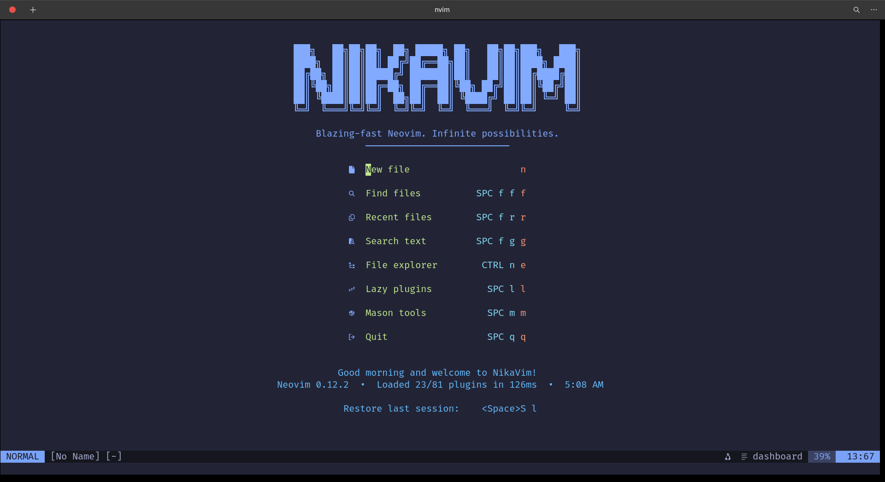

# 🛸NikaVim
<p align="center">
  
</p>

NikaVim is a modular Neovim distribution for everyday development. It keeps the entry point small, organizes features by concern, and ships with LSP, completion, formatting, search, Git tools, and a polished startup dashboard.

## Features

- Plugin management with Lazy.nvim.
- Language servers, formatters, and linters managed through Mason.
- LSP navigation, hover, rename, formatting, diagnostics, and code actions.
- Completion with nvim-cmp, LuaSnip, and friendly snippets.
- Tree-sitter highlighting, text objects, and incremental selection.
- Telescope file search, text search, buffers, help tags, commands, and recent files.
- Git integration with Gitsigns and vim-fugitive.
- Formatting with conform.nvim and linting with nvim-lint.
- UI polish with Tokyo Night, Lualine, Bufferline, NvimTree, Dressing, indent guides, and the NikaVim dashboard.
- Editing helpers for comments, autopairs, surround operations, match navigation, refactoring, and undo history.
---

## 🚀 Installation

Setting up NikaVim is completely automated. Follow the steps below to transform your terminal into a blazing-fast development engine.

### 📋 Prerequisites

Before installing, make sure your machine has the necessary core utilities installed:

| Dependency | Purpose | Installation (Fedora / RHEL) |
| :--- | :--- | :--- |
| **Neovim** (>= 0.10) | Core Editor | `sudo dnf install neovim` |
| **Git** | Repository Cloning | `sudo dnf install git` |
| **Tar & Unzip** | Compiling packages | `sudo dnf install tar unzip` |
| **Ripgrep** | Ultra-fast Telescope fuzzy searching | `sudo dnf install ripgrep` |

- **Make backup of your existing files**
```
# required
mv ~/.config/nvim{,.bak}

# optional but recommended
mv ~/.local/share/nvim{,.bak}
mv ~/.local/state/nvim{,.bak}
mv ~/.cache/nvim{,.bak}
```
- **Clone the stater repository**
```
git clone https://github.com/ae-orlando/nikavim-starter.git ~/.config/nvim
```
- **remove the .git folder**
```
rm -rf ~/.config/nvim/.git
```
-**start neovim**
```
nvim
```
- **You end up with something like this:**
---



## Quick Start

Open Neovim:

```bash
nvim
```

Lazy.nvim installs plugins automatically on first launch. Wait for the `NikaVim ready!` message.

Install common language servers:

```vim
:Mason
```

Recommended first installs:

- `lua_ls` for Lua
- `pyright` for Python
- `ts_ls` for JavaScript and TypeScript
- `html` for HTML
- `cssls` for CSS

You can also install a starter set from the command line:

```bash
nvim --headless +MasonInstall\ lua_ls\ pyright\ ts_ls\ html\ cssls +qa
```

## Project Layout

```text
~/.config/nvim/
|-- init.lua                 # Entry point
|-- lazy-lock.json           # Plugin lock file
|-- lua/
|   |-- core/
|   |   |-- init.lua         # Core module loader
|   |   |-- options.lua      # Editor options
|   |   `-- keymaps.lua      # Global keymaps
|   `-- plugins/
|       |-- init.lua         # Plugin module loader
|       |-- ui.lua           # Theme, statusline, explorer, dashboard
|       |-- treesitter.lua   # Syntax highlighting and text objects
|       |-- lsp.lua          # LSP and Mason setup
|       |-- completion.lua   # Completion and snippets
|       |-- telescope.lua    # Fuzzy finding
|       |-- editing.lua      # Editing helpers
|       |-- formatting.lua   # Formatting and linting
|       `-- git.lua          # Git integration
|-- README.md                # Overview
|-- QUICKSTART.md            # Short first-run guide
|-- SETUP.md                 # Full setup checklist
|-- KEYMAPS.md               # Keymap reference
|-- ADVANCED.md              # Customization and troubleshooting
|-- CHANGELOG.md             # Version history
`-- CONTRIBUTING.md          # Contribution guide
```

## Essential Keymaps

The leader key is `<Space>`.

| Key | Action |
| --- | --- |
| `<Space>ff` | Find files |
| `<Space>fg` | Search text |
| `<Space>fb` | Find buffers |
| `<Space>fr` | Recent files |
| `<C-n>` | Toggle file explorer |
| `K` | Hover documentation |
| `gd` | Go to definition |
| `gr` | Go to references |
| `<F2>` | Rename symbol |
| `<F3>` | Format buffer or selection |
| `<F4>` | Code action |
| `<Space>gs` | Git status |
| `<Space>l` | Lazy plugin manager |
| `<Space>m` | Mason package manager |

See [KEYMAPS.md](./KEYMAPS.md) for the full reference.

## Common Tasks

### Add a Plugin

Add the plugin spec to the most relevant file in `lua/plugins/`:

```lua
{
  "author/plugin.nvim",
  event = "BufReadPost",
  config = function()
    require("plugin").setup({})
  end,
}
```

Then run:

```vim
:Lazy sync
```

### Add a Keymap

Edit `lua/core/keymaps.lua`:

```lua
map("n", "<leader>x", function()
  -- your action
end, { desc = "Describe the action" })
```

### Add a Language Server

Install the server in Mason:

```vim
:Mason
```

Most servers are configured automatically by `mason-lspconfig`. For custom behavior, edit `lua/plugins/lsp.lua`.

### Change the Theme

The default theme is configured in `lua/plugins/ui.lua`.

For Tokyo Night variants, change the `style` field:

```lua
require("tokyonight").setup({
  style = "night",
})
```

Available Tokyo Night styles include `night`, `storm`, `moon`, and `day`.

## Troubleshooting

Run health checks first:

```vim
:checkhealth
```

Common fixes:

| Problem | Try |
| --- | --- |
| Plugins are missing | `:Lazy sync` |
| LSP is not attached | `:LspInfo` and `:Mason` |
| Completion is quiet | Install the relevant language server in Mason |
| Formatting is not working | Install the formatter in Mason and check `lua/plugins/formatting.lua` |
| Startup feels slow | `:Lazy profile` or `nvim --startuptime startup.log` |

See [ADVANCED.md](./ADVANCED.md) for deeper customization and troubleshooting notes.

## Documentation

- [INDEX.md](./INDEX.md): documentation map
- [QUICKSTART.md](./QUICKSTART.md): quickest path to a working editor
- [SETUP.md](./SETUP.md): fuller setup checklist
- [KEYMAPS.md](./KEYMAPS.md): keyboard reference
- [ADVANCED.md](./ADVANCED.md): customization and troubleshooting
- [CHANGELOG.md](./CHANGELOG.md): release notes
- [CONTRIBUTING.md](./CONTRIBUTING.md): contribution guide

## Notes

NikaVim is meant to be edited. The configuration is split into small files so you can remove features, swap plugins, or add your own workflow without digging through a monolithic `init.lua`.
